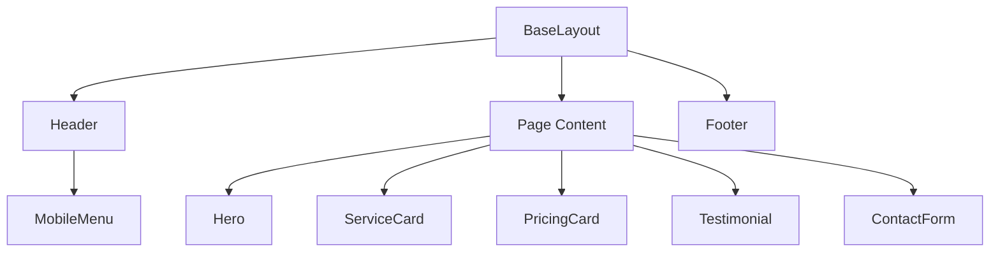

# Design Document

## Overview

### Purpose

This document describes the technical design for the Home Town Web Host marketing website, a static site built with the Astro framework. The website serves as the primary digital presence for a web hosting startup targeting small local businesses and individuals seeking AI-enabled website management.

### Key Design Principles

1. **Static-First Architecture**: Leverage Astro's zero-JavaScript-by-default approach to maximize performance
2. **Content-Driven Design**: Structure content using Astro's Content Collections for type-safe, maintainable content management
3. **Progressive Enhancement**: Add interactivity only where necessary (forms, mobile navigation)
4. **Accessibility-First**: Build with WCAG 2.1 AA compliance from the ground up
5. **Mobile-First Responsive**: Design for smallest screens first, enhance for larger viewports

### Target Audience

- Small local businesses (restaurants, landscapers, contractors)
- Individuals seeking personal web hosting
- Non-technical users who value simplicity and AI-assisted management

### Technology Stack

- **Framework**: Astro 5.x (static site generation)
- **Styling**: CSS with modern features (container queries, CSS Grid, custom properties)
- **Validation**: HTML5 native validation + progressive JavaScript enhancement
- **Image Optimization**: Astro's built-in Image component
- **Deployment**: Static hosting (Netlify, Vercel, or Cloudflare Pages)

### Research Findings

**Astro Framework Best Practices** ([Astro documentation](https://docs.astro.build)):

- Astro's Islands Architecture enables shipping zero JavaScript by default while allowing interactive components where needed
- Content Collections provide type-safe content management with automatic TypeScript type generation
- Built-in image optimization handles responsive images and modern formats automatically
- Static site generation ensures optimal performance with CDN caching

**Form Validation Patterns** (based on industry research):

- Client-side validation provides immediate feedback but must be paired with server-side validation
- HTML5 input types (email, tel, number) provide native validation and appropriate mobile keyboards
- Inline validation during input improves user experience compared to submit-only validation
- Clear, specific error messages associated with fields improve completion rates

**Responsive Design Standards** (2024/2025 industry standards):

- Mobile-first approach reflects 54%+ mobile web traffic
- Standard breakpoints: mobile (<768px), tablet (768-1024px), desktop (>1024px)
- Content-driven breakpoints preferred over device-specific targeting
- Minimum 44px touch targets for mobile accessibility

## Architecture

### Site Structure

```
/
├── src/
│   ├── pages/               # Route-based pages
│   │   ├── index.astro      # Homepage
│   │   ├── services.astro   # Services/Features page
│   │   ├── pricing.astro    # Pricing page
│   │   ├── about.astro      # About page
│   │   ├── contact.astro    # Contact page
│   │   ├── privacy.astro    # Privacy Policy
│   │   └── terms.astro      # Terms of Service
│   ├── components/          # Reusable components
│   │   ├── Header.astro     # Site header with navigation
│   │   ├── Footer.astro     # Site footer
│   │   ├── Hero.astro       # Hero section component
│   │   ├── ServiceCard.astro
│   │   ├── PricingCard.astro
│   │   ├── Testimonial.astro
│   │   ├── ContactForm.astro
│   │   └── MobileMenu.astro # Mobile navigation
│   ├── layouts/
│   │   └── BaseLayout.astro # Base layout wrapper
│   ├── content/             # Content collections
│   │   ├── config.ts        # Content collection schemas
│   │   ├── testimonials/    # Customer testimonials
│   │   ├── services/        # Service descriptions
│   │   └── pricing/         # Pricing plans
│   ├── styles/
│   │   ├── global.css       # Global styles and CSS custom properties
│   │   └── reset.css        # CSS reset
│   └── scripts/
│       ├── form-validation.ts  # Form validation logic
│       └── mobile-menu.ts      # Mobile menu toggle
├── public/
│   ├── images/              # Static images
│   ├── robots.txt
│   └── sitemap.xml
└── astro.config.mjs         # Astro configuration
```

### Rendering Strategy

- **Static Site Generation (SSG)**: All pages pre-rendered at build time for optimal performance
- **No Server-Side Rendering**: Pure static output suitable for CDN deployment
- **Client-Side Hydration**: Minimal JavaScript only for contact form validation and mobile menu

### Content Management Approach

Use Astro Content Collections to manage structured content:

1. **Testimonials Collection**: Type-safe testimonial data with schema validation
2. **Services Collection**: Service descriptions and features
3. **Pricing Collection**: Pricing plan details with promotional pricing support

Content stored as Markdown with frontmatter, providing:

- Type safety via Zod schemas
- IDE autocomplete and validation
- Easy content updates without code changes
- Build-time validation of content structure

## Components and Interfaces

### Core Components

#### 1. BaseLayout.astro

Base layout wrapper providing consistent structure across all pages.

**Props Interface**:

```typescript
interface Props {
  title: string; // Page title (50-60 chars for SEO)
  description: string; // Meta description (150-160 chars)
  ogImage?: string; // Open Graph image URL
  canonicalURL?: string; // Canonical URL for SEO
}
```

**Responsibilities**:

- Render HTML document structure
- Include meta tags (title, description, Open Graph)
- Load global styles
- Include Header and Footer components
- Manage viewport meta tag for responsive design

#### 2. Header.astro

Site header with logo and navigation menu.

**Props**: None (static content)

**Responsibilities**:

- Display logo/company name
- Render horizontal navigation for desktop (>768px)
- Render hamburger menu icon for mobile (<768px)
- Highlight active page in navigation
- Ensure keyboard accessibility

**State Management**: Active page determined by Astro.url.pathname

#### 3. MobileMenu.astro

Collapsible mobile navigation menu.

**Props**: None

**Responsibilities**:

- Render as hidden by default
- Toggle visibility via hamburger button
- Display navigation links in vertical stack
- Close menu when link is clicked or when clicking outside
- Trap focus within menu when open (accessibility)

**Client-Side Behavior**: Requires ~50 lines of JavaScript for toggle and focus management

#### 4. Hero.astro

Hero section component for homepage.

**Props Interface**:

```typescript
interface Props {
  heading: string;
  subheading: string;
  ctaText: string;
  ctaLink: string;
  backgroundImage?: string;
}
```

**Responsibilities**:

- Render large heading with company name
- Display value proposition
- Include prominent CTA button
- Support optional background image with proper contrast
- Ensure text remains readable on all backgrounds

#### 5. ServiceCard.astro

Reusable card component for displaying service information.

**Props Interface**:

```typescript
interface Props {
  title: string;
  description: string;
  icon?: string;
  features: string[];
  link?: string;
}
```

**Responsibilities**:

- Display service title and description
- Render feature list
- Include optional icon
- Provide optional link to more details

#### 6. PricingCard.astro

Card component for displaying pricing plans.

**Props Interface**:

```typescript
interface Props {
  planName: string;
  monthlyPrice: number;
  annualPrice: number;
  features: string[];
  isPopular?: boolean;
  promotionalPrice?: {
    monthly: number;
    annual: number;
    expiresAt: Date;
  };
  additionalCosts?: {
    description: string;
    amount: number;
  }[];
}
```

**Responsibilities**:

- Display plan name and prices with proper formatting (2 decimal places, $ symbol)
- Show both monthly and annual pricing
- Render promotional pricing with strikethrough on original price
- Display expiration date for promotions
- List included features
- Show additional costs separately
- Highlight popular plans visually

**Price Formatting**: Use Intl.NumberFormat for consistent currency display

#### 7. Testimonial.astro

Component for displaying customer testimonials.

**Props Interface**:

```typescript
interface Props {
  quote: string;
  author: string;
  businessName?: string;
  businessType?: string;
}
```

**Responsibilities**:

- Display customer quote
- Show author name and business information
- Use semantic HTML (blockquote, cite)

#### 8. ContactForm.astro

Contact form with validation.

**Props**: None

**Responsibilities**:

- Render form with all required fields
- Implement HTML5 validation attributes
- Show/hide website name field based on "existing website" selection
- Display inline validation errors
- Handle form submission to endpoint
- Display success/error messages
- Preserve form data on submission failure
- Show alternative contact methods

**Form Fields**:

```typescript
interface ContactFormData {
  name: string; // max 100 chars, required
  hasExistingWebsite: "yes" | "no"; // dropdown, default 'yes'
  websiteName?: string; // max 100 chars, conditional
  email: string; // max 254 chars, required, email format
  phone?: string; // max 20 chars, optional, phone format
  message: string; // max 1000 chars, required
}
```

**Validation Rules**:

- Name: required, max 100 characters
- Email: required, max 254 characters, must contain @ followed by domain
- Phone: optional, max 20 characters, only digits, spaces, hyphens, parentheses, plus sign
- Message: required, max 1000 characters
- Website name: conditional (only if hasExistingWebsite === 'yes'), max 100 characters

**Client-Side Behavior**:

- Validate on blur for each field
- Show inline error messages below fields
- Prevent submission if validation fails
- Display loading state during submission
- 30-second timeout on submission
- Retain form data if submission fails

**Endpoint**: POST to configured contact endpoint (environment variable)

#### 9. Footer.astro

Site footer with links and legal information.

**Props**: None

**Responsibilities**:

- Display navigation links (Privacy Policy, Terms of Service)
- Show copyright information with dynamic year
- Display social media links (if configured)
- Ensure all links are keyboard accessible
- Use semantic HTML (footer, nav)

### Component Interaction Patterns



**Data Flow**:

1. Content Collections → Page components (via Astro's Content API)
2. Page components → UI components (via props)
3. User interactions → Client-side scripts → DOM updates
4. Form submission → External endpoint → Response message

## Data Models

### Content Collection Schemas

#### Testimonials Collection

```typescript
// src/content/config.ts
import { defineCollection, z } from "astro:content";

const testimonialsCollection = defineCollection({
  type: "data",
  schema: z.object({
    quote: z.string().min(20).max(500),
    author: z.string().min(2).max(100),
    businessName: z.string().max(100).optional(),
    businessType: z.string().max(50).optional(),
    order: z.number().int().positive(),
  }),
});
```

**Usage**: Load testimonials in homepage, sort by order field, display 2+ testimonials

#### Services Collection

```typescript
const servicesCollection = defineCollection({
  type: "content", // Markdown with frontmatter
  schema: z.object({
    title: z.string().min(5).max(100),
    description: z.string().min(20).max(500),
    icon: z.string().optional(),
    features: z.array(z.string()),
    targetAudience: z.array(z.string()),
    order: z.number().int().positive(),
  }),
});
```

**Usage**: Load services in services page, sort by order, render as ServiceCards

#### Pricing Collection

```typescript
const pricingCollection = defineCollection({
  type: "data",
  schema: z.object({
    planName: z.string().min(3).max(50),
    planType: z.enum([
      "basic-business",
      "basic-personal",
      "ai-business",
      "ai-personal",
      "custom",
    ]),
    monthlyPrice: z.number().nonnegative(),
    annualPrice: z.number().nonnegative(),
    features: z.array(z.string()),
    technicalSpecs: z
      .object({
        storage: z.string().optional(),
        bandwidth: z.string().optional(),
        domains: z.string().optional(),
        email: z.string().optional(),
        support: z.string().optional(),
        aiFeatures: z.boolean(),
      })
      .optional(),
    isPopular: z.boolean().default(false),
    promotionalPricing: z
      .object({
        monthly: z.number().positive(),
        annual: z.number().positive(),
        expiresAt: z.date(),
      })
      .optional(),
    additionalCosts: z
      .array(
        z.object({
          description: z.string(),
          amount: z.number().nonnegative(),
        }),
      )
      .optional(),
    order: z.number().int().positive(),
    contactForPricing: z.boolean().default(false),
  }),
});

export const collections = {
  testimonials: testimonialsCollection,
  services: servicesCollection,
  pricing: pricingCollection,
};
```

**Usage**: Load pricing plans in pricing page, sort by order, render as PricingCards

### Configuration Data Models

#### Site Configuration

```typescript
// src/config.ts
export interface SiteConfig {
  name: string;
  description: string;
  url: string;
  contactEmail: string;
  contactPhone: string;
  contactEndpoint: string;
  socialMedia?: {
    facebook?: string;
    twitter?: string;
    linkedin?: string;
    instagram?: string;
  };
  seo: {
    defaultTitle: string;
    titleTemplate: string;
    defaultDescription: string;
    defaultOgImage: string;
  };
}

export const siteConfig: SiteConfig = {
  name: "Home Town Web Host",
  description:
    "Web hosting for small local businesses with AI-enabled website management",
  url: "https://hometownwebhost.com",
  contactEmail: "support@hometownwebhost.com",
  contactPhone: "+1-XXX-XXX-XXXX",
  contactEndpoint: import.meta.env.CONTACT_ENDPOINT,
  socialMedia: {
    // Configured if available
  },
  seo: {
    defaultTitle: "Home Town Web Host",
    titleTemplate: "%s | Home Town Web Host",
    defaultDescription:
      "Affordable web hosting for small businesses with AI-enabled management",
    defaultOgImage: "/images/og-default.jpg",
  },
};
```

### Form Data Models

#### Contact Form Submission

```typescript
interface ContactSubmission {
  name: string;
  hasExistingWebsite: boolean;
  websiteName?: string;
  email: string;
  phone?: string;
  message: string;
  timestamp: string;
  userAgent: string;
}
```

**Validation**: Validated client-side and must be re-validated server-side at endpoint

#### Contact Form Response

```typescript
interface ContactResponse {
  success: boolean;
  message: string;
  errors?: {
    field: string;
    message: string;
  }[];
}
```

### Responsive Breakpoints Model

```typescript
const breakpoints = {
  mobile: "768px", // max-width for mobile styles
  tablet: "1024px", // max-width for tablet styles
  desktop: "1025px", // min-width for desktop styles
} as const;
```

**CSS Custom Properties**:

```css
:root {
  --breakpoint-mobile: 768px;
  --breakpoint-tablet: 1024px;
  --touch-target-min: 44px;
  --spacing-min: 8px;
  --font-size-mobile-min: 16px;
}
```

## Error Handling

### Client-Side Form Validation Errors

**Error Display Strategy**:

- Display errors inline below the relevant field
- Use ARIA attributes (aria-invalid, aria-describedby) for accessibility
- Show errors on blur and on submit attempt
- Clear errors when user corrects the input

**Error Message Patterns**:

```typescript
const errorMessages = {
  name: {
    required: "Name is required",
    maxLength: "Name must be 100 characters or less",
  },
  email: {
    required: "Email is required",
    invalid: "Please enter a valid email address (e.g., name@example.com)",
    maxLength: "Email must be 254 characters or less",
  },
  phone: {
    invalid:
      "Please enter a valid phone number (digits, spaces, hyphens, parentheses, or + only)",
    maxLength: "Phone number must be 20 characters or less",
  },
  message: {
    required: "Message is required",
    maxLength: "Message must be 1000 characters or less",
  },
  websiteName: {
    maxLength: "Website name must be 100 characters or less",
  },
};
```

### Form Submission Errors

**Timeout Handling**:

- If endpoint doesn't respond within 30 seconds, display timeout error
- Preserve all form data
- Allow user to retry submission

**Network Errors**:

- Catch fetch errors and display user-friendly message
- Preserve form data
- Suggest alternative contact methods

**Server Errors**:

- Display server-provided error message if available
- Fall back to generic error message
- Preserve form data

**Error Message Display**:

```typescript
interface ErrorDisplayConfig {
  type: "inline" | "banner";
  severity: "error" | "warning" | "info";
  message: string;
  dismissible: boolean;
  autoHide?: number; // milliseconds
}
```

### Navigation Errors

**Broken Link Handling** (Requirement 5.6):

- Create custom 404 page (src/pages/404.astro)
- Display user-friendly message
- Include navigation back to home
- Show main navigation menu
- Maintain site branding

**Slow Navigation Handling** (Requirement 5.5):

- If navigation takes >100ms (unlikely with static site), show loading indicator
- Use CSS-based loading spinner
- Position loading indicator near navigation element

### Image Loading Errors

**Missing Image Handling**:

- Provide fallback images for all critical images
- Use alt text to convey information even without image
- Gracefully degrade if optional images fail to load

**Lazy Loading Errors**:

- If image fails to load via intersection observer, fall back to standard loading
- Log errors for monitoring but don't interrupt user experience

### Performance Degradation

**Slow Network Handling**:

- Astro's static output ensures page loads even on slow connections
- Critical CSS inlined in <head> for fast initial render
- Non-critical assets deferred

**JavaScript Failure**:

- Form uses HTML5 validation as fallback if JavaScript fails
- Mobile menu degrades gracefully (consider CSS-only fallback)
- Site remains functional without JavaScript (form may need server-side fallback)

### Accessibility Error Prevention

**Focus Management Errors**:

- If focus trap in mobile menu fails, ensure Escape key still closes menu
- Ensure focus always visible (never lost)

**Screen Reader Errors**:

- Ensure all error messages announced via ARIA live regions
- Provide text alternatives for all critical information
- Use semantic HTML to ensure graceful degradation

## Testing Strategy

This feature represents a marketing website with primarily presentational logic and form validation. Property-based testing is **NOT appropriate** for this feature because:

1. **Mostly Presentational UI**: The bulk of the website is static content rendering (hero sections, service cards, pricing displays) which is best validated through snapshot tests and visual regression testing

2. **Infrastructure/Configuration**: Many requirements involve deployment configuration, CDN caching, SEO meta tags, and responsive breakpoints which are not suitable for PBT

3. **Form Validation**: While there is validation logic, it's primarily constraint checking (length limits, format validation) that is better tested with example-based unit tests covering specific edge cases

4. **External Service Integration**: The contact form submission depends on an external endpoint, making it unsuitable for pure property-based testing

### Testing Approach

#### 1. Unit Tests (Example-Based)

Focus on specific validation logic and data formatting:

**Form Validation Tests**:

- Test email validation with valid examples: "user@example.com", "name+tag@domain.co.uk"
- Test email validation with invalid examples: "user", "user@", "@domain.com", "user @domain.com"
- Test phone validation with valid examples: "+1-555-555-5555", "(555) 555-5555", "555.555.5555"
- Test phone validation with invalid examples: "123abc", "phone number"
- Test length limits at boundaries: 99, 100, 101 characters for name field
- Test conditional field logic: website name required when hasExistingWebsite=true, not required when false

**Price Formatting Tests**:

- Test currency formatting: 9.99 → "$9.99", 100 → "$100.00", 0 → "$0.00"
- Test promotional price display with expiration dates
- Test additional costs calculation

**Content Collection Tests**:

- Test schema validation with valid and invalid data
- Test sorting by order field
- Test optional field handling

#### 2. Integration Tests

Test component integration and user flows:

**Contact Form Flow**:

- Fill form with valid data → submit → verify endpoint called with correct payload
- Fill form with missing required fields → submit → verify error messages displayed
- Submit form → endpoint returns error → verify error message displayed and data preserved
- Submit form → endpoint times out → verify timeout message and data preserved

**Navigation Flow**:

- Click each navigation link → verify correct page loads
- Mobile: open hamburger menu → click link → verify menu closes and page loads
- Verify active page highlighted in navigation

**Responsive Behavior**:

- Verify layout changes at 768px breakpoint (single-column vs multi-column)
- Verify hamburger menu appears/disappears at 768px breakpoint
- Verify touch target sizes on mobile (minimum 44x44px)

#### 3. Accessibility Tests

Use automated accessibility testing tools:

- **axe-core**: Automated accessibility scanning for WCAG 2.1 AA violations
- **Keyboard navigation**: Tab through all interactive elements, verify focus indicators visible
- **Screen reader testing**: Manual testing with NVDA/VoiceOver for form errors, navigation, and content structure
- **Color contrast**: Automated tools to verify 4.5:1 ratio for normal text, 3:1 for large text
- **Focus management**: Verify focus trap in mobile menu, verify focus on error messages

#### 4. Snapshot Tests

Capture rendered output for regression detection:

- Snapshot test each page's HTML structure
- Snapshot test each major component (Hero, ServiceCard, PricingCard, etc.)
- Update snapshots when intentional design changes made

#### 5. Visual Regression Tests

Compare screenshots across changes:

- Use tools like Percy, Chromatic, or BackstopJS
- Capture screenshots at all major breakpoints (375px, 768px, 1024px, 1440px)
- Test all pages and major UI states (mobile menu open, form errors, etc.)

#### 6. Performance Tests

Verify performance requirements:

**Lighthouse CI**:

- First Contentful Paint < 3 seconds (Requirement 8.1)
- Image sizes < 500KB (Requirement 8.2)
- CSS bundle < 100KB (Requirement 8.3)
- JavaScript bundle < 300KB (Requirement 8.3)

**Manual Testing**:

- Test on throttled connection (25 Mbps, 100ms latency)
- Verify lazy loading for below-fold images (Requirement 8.4)

#### 7. SEO Tests

Verify SEO requirements:

- Meta title length between 50-60 characters (Requirement 9.1)
- Meta description length between 150-160 characters (Requirement 9.2)
- Single H1 per page, sequential heading levels (Requirement 9.3)
- sitemap.xml exists and contains all pages (Requirement 9.4)
- Open Graph tags present on all pages (Requirement 9.5)
- robots.txt allows crawling (Requirement 9.6)

#### 8. Cross-Browser Testing

Test on major browsers:

- Chrome/Edge (latest)
- Firefox (latest)
- Safari (latest)
- Mobile Safari (iOS)
- Chrome Mobile (Android)

### Test Organization

```
tests/
├── unit/
│   ├── form-validation.test.ts
│   ├── price-formatting.test.ts
│   └── content-collections.test.ts
├── integration/
│   ├── contact-form.test.ts
│   ├── navigation.test.ts
│   └── responsive.test.ts
├── accessibility/
│   ├── axe.test.ts
│   └── keyboard-navigation.test.ts
├── snapshots/
│   └── components.test.ts
└── e2e/
    ├── homepage.test.ts
    ├── services.test.ts
    ├── pricing.test.ts
    └── contact.test.ts
```

### Testing Tools

- **Unit/Integration Tests**: Vitest
- **E2E Tests**: Playwright
- **Accessibility**: axe-core + @axe-core/playwright
- **Visual Regression**: Percy or Chromatic
- **Performance**: Lighthouse CI
- **Code Coverage**: Vitest coverage (aim for >80% on validation logic)

### Continuous Integration

All tests should run on:

- Every pull request
- Before deployment to production
- On a scheduled basis (daily) for monitoring

Deployment should be blocked if:

- Any tests fail
- Accessibility violations found
- Performance budgets exceeded
- Coverage drops below threshold
